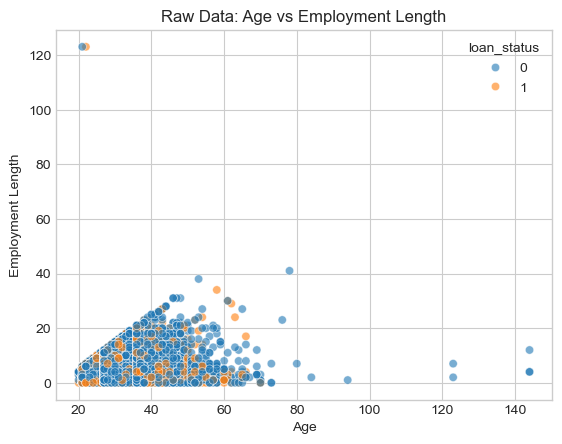
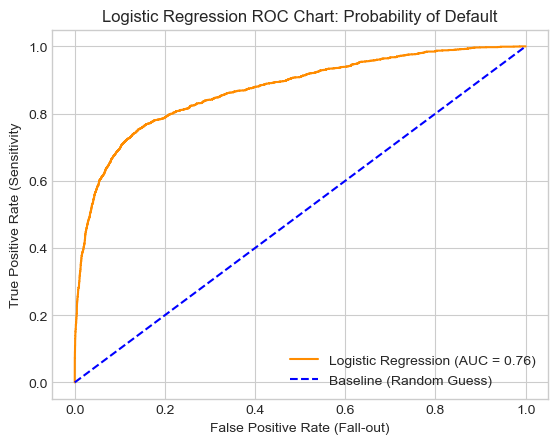
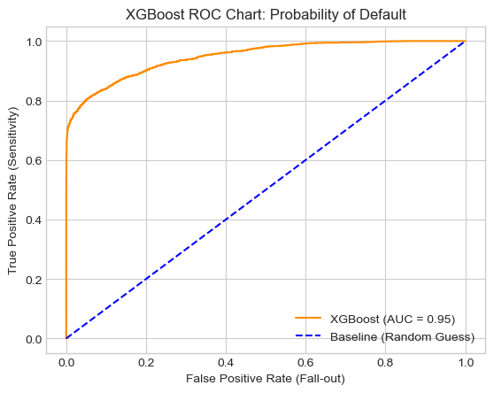
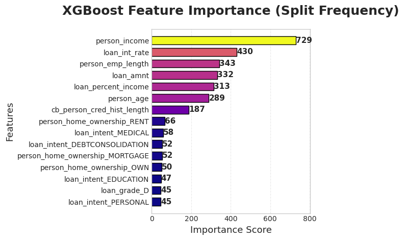
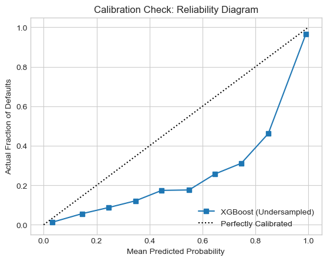

# 📊 Credit Risk Modelling — Logistic Regression vs XGBoost Strategy

This project builds a **machine learning credit risk prediction system** to estimate the probability of loan default and design **profit-driven lending strategies**.

The modelling workflow follows industry practices and extends into **business decision optimisation**, making this project closer to real-world banking analytics than a standard ML notebook.

---

## 🎯 Project Objective

The goals of this project are to:

- Predict **loan default probability (PD)**
- Compare **Logistic Regression** and **XGBoost**
- Identify key **risk drivers**
- Design **threshold-based lending strategies**
- Optimize decisions for **maximum portfolio profit**, not just accuracy

---

## 📁 Dataset Description

The dataset contains borrower-level financial and demographic features:
(Dataset extracted from Kaggle)
| Category | Example Features |
|---------|------------------|
| Personal | Age, Employment Length, Home Ownership |
| Financial | Income, Loan Amount, Interest Rate |
| Credit | Loan Grade, Historical Behaviour |

**Target Variable**  
`loan_status`  
- 1 = Default  
- 0 = Non-default  

---

# 🔍 Data Cleaning & Preprocessing

## ✔ Outlier Handling
Unrealistic borrower records were removed:
- Age > 100  
- Employment length > 60 years  

This improves data quality and prevents model distortion.

## ✔ Missing Value Treatment
Null values were detected and handled prior to modelling.

## ✔ Categorical Encoding
Categorical features were transformed using **one-hot encoding**.

## ✔ Feature Scaling
`StandardScaler` was applied before Logistic Regression to ensure:
- Faster convergence  
- Balanced feature influence  

---

# 🤖 Model 1 — Logistic Regression (Baseline Model)

Logistic Regression was used as an interpretable benchmark.

**Why it matters in credit risk:**
- Provides **coefficient-based explanations**
- Shows **direction of risk impact**
- Common in traditional scorecard systems

### Insights from Logistic Model
- Higher interest rates → higher default probability  
- Lower income → higher risk  
- Short employment length → higher risk  

This model answers:  
> “Why is this borrower risky?”

---

# 🌲 Model 2 — XGBoost (Advanced Model)

XGBoost, a gradient boosting algorithm, was used to capture:

- Non-linear relationships  
- Feature interactions  
- Complex borrower behaviour patterns  

## Feature Importance

The model identifies which variables most influence default prediction, offering a complementary perspective to logistic regression.

---

# 📈 Model Performance Comparison

| Aspect | Logistic Regression | XGBoost |
|--------|---------------------|---------|
| Interpretability | ⭐⭐⭐⭐⭐ | ⭐⭐ |
| Predictive Power | ⭐⭐⭐ | ⭐⭐⭐⭐⭐ |
| Handles Nonlinearity | ❌ | ✅ |
| Use Case | Credit scorecard | Risk ranking engine |

**Conclusion:**  
Logistic Regression explains risk.  
XGBoost predicts risk more accurately.

---

# ⚖️ Class Imbalance Handling

Undersampling was used to balance default vs non-default classes.

**Impact:**
- Improves model learning on minority class  
- May inflate predicted probabilities  

This shows awareness of real-world credit modelling challenges.

---

# 💡 Business Strategy Simulation (Key Differentiator)

Unlike typical ML projects, this work extends into **lending policy simulation**.

Predicted probabilities were used to simulate approval strategies.

| Metric | Description |
|--------|-------------|
| Acceptance Rate | % of loans approved |
| Bad Rate | % of approved loans that default |
| Projected Profit | Profit after default losses |

---

## 🔑 Threshold Optimization

Multiple probability thresholds were tested.

**Key Insight:**
> The best threshold is not the one with highest accuracy —  
> it is the one that **maximizes profit**.

This transforms the project from:
**Machine Learning model → Financial decision system**

---

# 🆚 Comparison With Typical ML Projects

| Feature | Typical Notebook | This Project |
|---------|------------------|--------------|
| Outlier Cleaning | Often skipped | ✅ Applied |
| Feature Scaling | Sometimes | ✅ Applied |
| Model Comparison | Limited | ✅ 2 Models |
| Interpretability | Basic | ✅ Detailed |
| Business Simulation | Rare | ⭐ Advanced |
| Profit Optimization | No | ✅ Yes |

---

# 🧠 Key Risk Drivers Identified

Common influential features include:

- Interest Rate  
- Income Level  
- Employment Length  
- Loan Grade  

These align with real-world credit risk theory.

---

# 🏆 Key Takeaways

- Credit risk modelling is both **predictive** and **strategic**
- Logistic Regression = transparency
- XGBoost = performance
- Threshold choice impacts **profit more than accuracy**
- Business impact matters more than AUC alone

---

# 🚀 Future Improvements

- Use SMOTE instead of undersampling  
- Apply probability calibration  
- Cross-validation  
- Try LightGBM / CatBoost  
- Cost-sensitive learning  

---

# 📌 Final Conclusion

This project demonstrates a **complete credit risk modelling pipeline** including:

✔ Data cleaning  
✔ Risk prediction  
✔ Model interpretation  
✔ Business strategy optimisation  

It reflects **real-world financial analytics**, not just model training.
